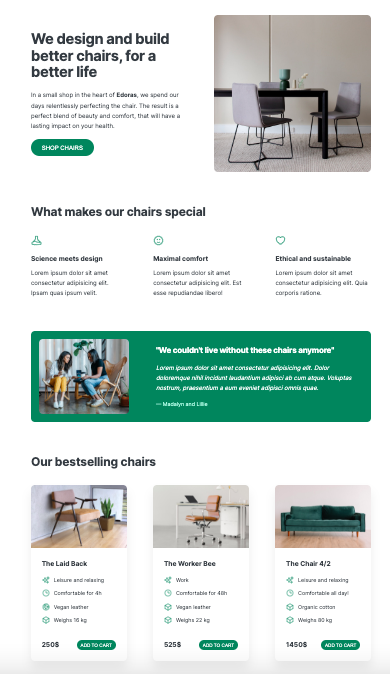

# Edoras Chair Shop web

## Website Project

This project is a website built using Responsive Web Design (RWD) techniques, but without the mobile-first approach. The website consists of the following sections: header, features, testimonial, and a product section where three cards with product descriptions and images are displayed. Additionally, the website includes call-to-action buttons aimed to engage users with its content.

During the project, I focused on creating a website that would catch the attention of users and encourage them to interact with its content.

### Technologies

The following technologies were used to create this website:

- HTML5
- CSS3

### Summary

This is my first project in self-study of HTML markup language and CSS. This project allowed me to familiarize myself with the basic techniques of designing responsive websites and to improve my HTML and CSS skills.
